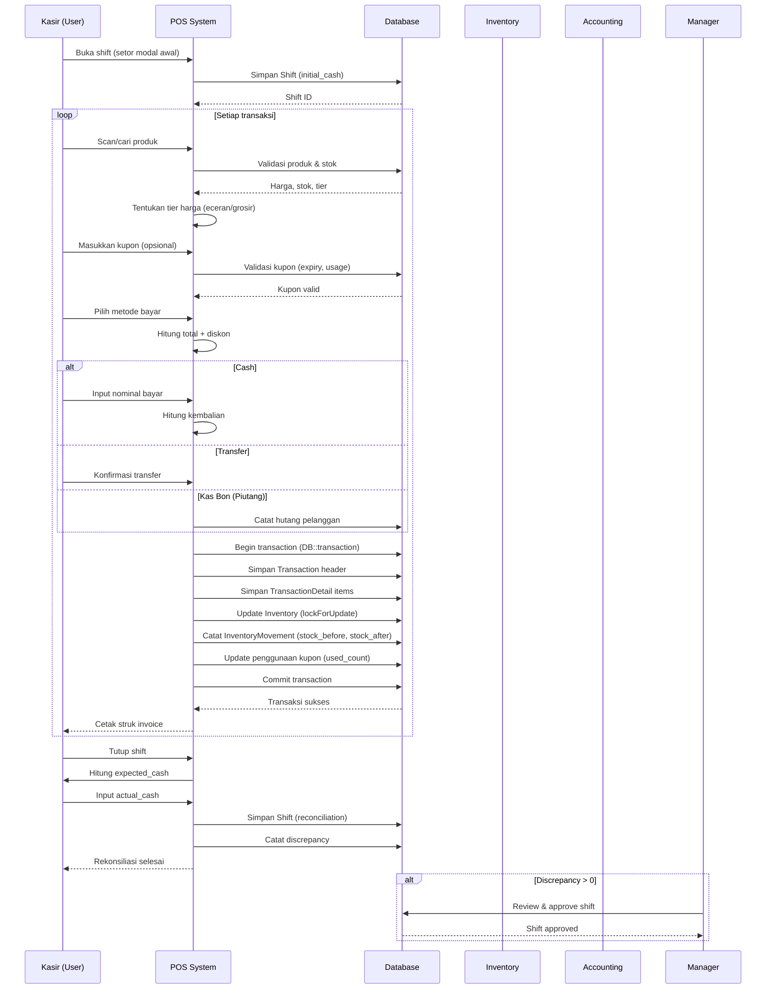
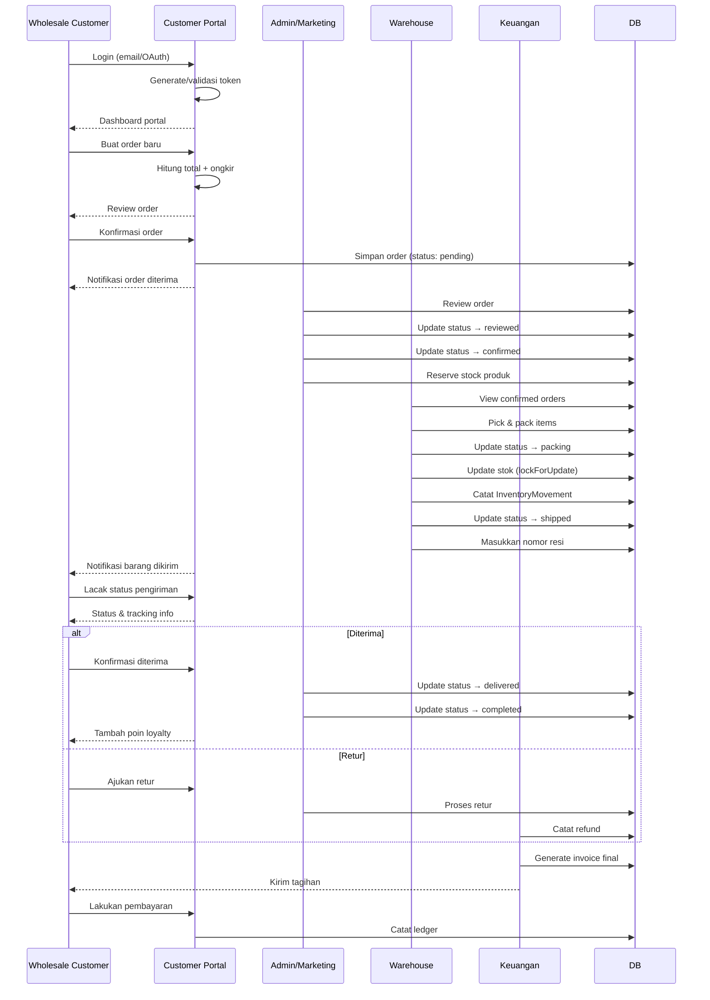
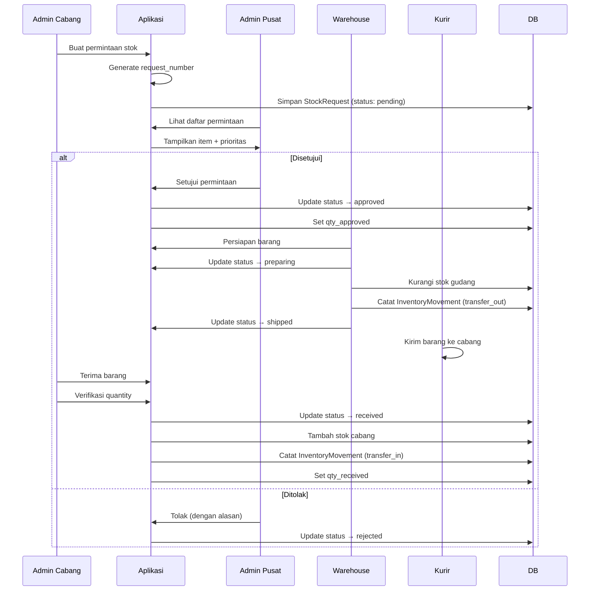
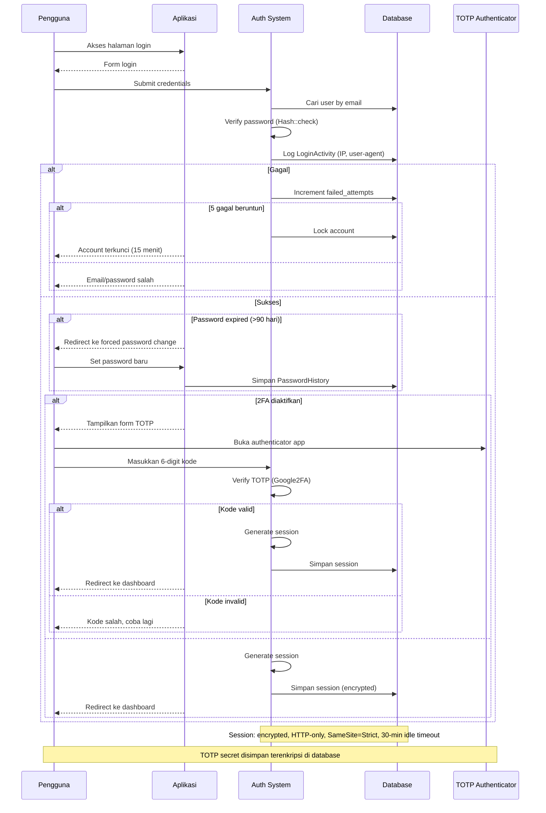
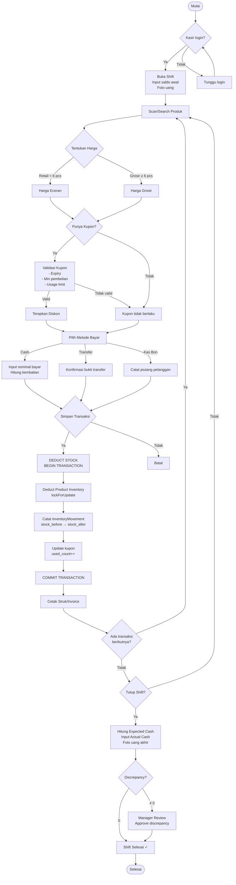
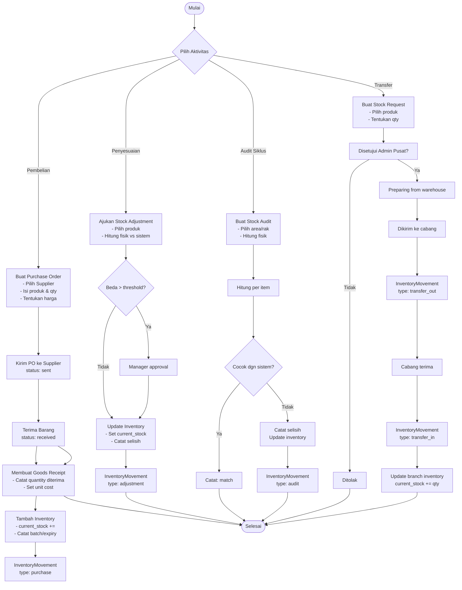
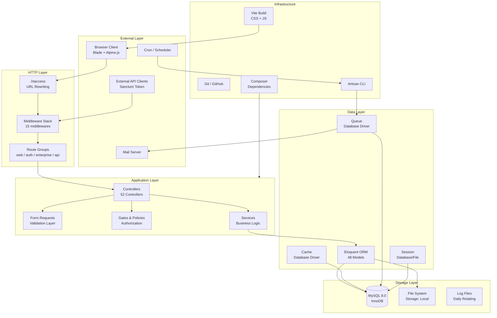
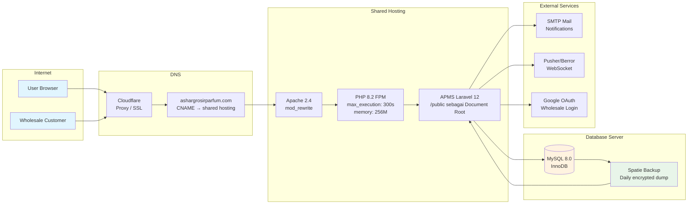

<p align="center">
  
</p>

<h1 align="center">APMS — Ashar Parfume Management System</h1>

<p align="center">
  <strong>Enterprise Point-of-Sale, Inventory, Wholesale & HR Management Platform</strong><br>
  <sub>Proprietary system for Ashar Grosir Parfum · Laravel 12 · PHP 8.2+ · MySQL 8.0</sub>
</p>

<p align="center">
  
  
  
  
  
</p>

---

## Table of Contents

- [1. System Overview](#1-system-overview)
- [2. Core Features](#2-core-features)
- [3. Architecture & Stack](#3-architecture--stack)
- [4. Security Architecture](#4-security-architecture)
- [5. Role-Based Access Control](#5-role-based-access-control)
- [6. Module Guide](#6-module-guide)
- [7. Installation](#7-installation)
- [8. Deployment to Shared Hosting](#8-deployment-to-shared-hosting)
- [9. API Reference](#9-api-reference)
- [10. Database Schema](#10-database-schema)
- [11. Development Workflow](#11-development-workflow)
- [12. System Diagrams](#12-system-diagrams)
  - [12.1 Class Diagram — Core Domain Model](#121-class-diagram--core-domain-model)
  - [12.2 Sequence Diagram — POS Transaction Flow](#122-sequence-diagram--pos-transaction-flow)
  - [12.3 Sequence Diagram — Wholesale Order Fulfillment](#123-sequence-diagram--wholesale-order-fulfillment)
  - [12.4 Sequence Diagram — Stock Request Fulfillment Pipeline](#124-sequence-diagram--stock-request-fulfillment-pipeline)
  - [12.5 Sequence Diagram — Authentication & 2FA Flow](#125-sequence-diagram--authentication--2fa-flow)
  - [12.6 Workflow Diagram — Sales Order-to-Cash Process](#126-workflow-diagram--sales-order-to-cash-process)
  - [12.7 Workflow Diagram — Inventory Management Lifecycle](#127-workflow-diagram--inventory-management-lifecycle)
  - [12.8 Workflow Diagram — B2B Wholesale Order Fulfillment](#128-workflow-diagram--b2b-wholesale-order-fulfillment)
  - [12.9 Workflow Diagram — Employee & Payroll Lifecycle](#129-workflow-diagram--employee--payroll-lifecycle)
  - [12.10 Component Diagram — Application Layer Architecture](#1210-component-diagram--application-layer-architecture)
  - [12.11 Deployment Architecture](#1211-deployment-architecture)
- [13. Disaster Recovery](#13-disaster-recovery)
- [14. License](#14-license)

---

## 1. System Overview

APMS (Ashar Parfume Management System) is a **production-grade enterprise platform** built exclusively for Ashar Grosir Parfum — a multi-branch perfume wholesale and retail business in Bekasi, Indonesia.

The system unifies **Point-of-Sale (POS)**, **inventory logistics**, **wholesale B2B management**, **employee payroll**, **commission tracking**, and **business intelligence reporting** into a single, real-time platform with branch-level data isolation.

### Key Business Objectives

| Objective | Solution |
|-----------|----------|
| Eliminate cashier discrepancies | Shift reconciliation with blind-drop protocol and photo evidence |
| Prevent overselling | ACID-transactional stock deduction with `lockForUpdate()` concurrency |
| Multi-branch visibility | Owner dashboard aggregates all branches; branch-scoped isolation for others |
| Wholesale customer autonomy | Customer portal with token-based access, order tracking, loyalty points |
| Regulatory compliance | Encrypted PII (bank accounts, NPWP, NIK), 2FA, audit trail, password policy |

---

## 2. Core Features

### Retail POS
- **Multi-tier pricing** — automatic switching between retail (eceran) and wholesale (grosir) pricing
- **Coupon engine** — percentage/fixed discounts with expiration and usage-limit validation
- **Hybrid payments** — cash, transfer, or *kas bon* (authorized debt) with automatic ledger posting
- **Bonus stock** — configurable buy-N-get-X bonus items per product
- **Refill system** — volume-based refill tracking for fragrance oils (ml)

### Inventory & Supply Chain
- **Multi-warehouse** — branch-attached warehouses with transferable stock
- **Stock requests** — branch-to-warehouse fulfillment pipeline (request → approve → prepare → ship → receive)
- **Purchase orders** — supplier PO lifecycle (draft → sent → received) with COGS tracking
- **Goods receipts** — incoming stock logging with batch/expiry tracking
- **Expiry alerts** — automatic 90/60/30-day expiry warnings
- **Inventory movements** — immutable audit trail for every stock mutation (sale, adjustment, audit, transfer)

### Wholesale B2B
- **Wholesale product catalog** — separate pricing matrix (per-piece, per-pack, per-box)
- **Order lifecycle** — pending → reviewed → confirmed → packing → shipped → delivered → completed
- **Tracking numbers** — delivery tracking with status updates
- **Customer portal** — token-based access for order history, statements, loyalty
- **Google OAuth** — social login for wholesale customers
- **Loyalty system** — rank-based tiers (Regular/VIP/Silver/Gold/Platinum) with credit-based rewards
- **Referral program** — customer referral tracking with leaderboard

### Employee & HR
- **Employee database** — comprehensive profiles (NIK, NPWP, bank, salary, emergency contacts)
- **Attendance** — check-in/check-out with role-based recording
- **Shift management** — open/close protocol with cash reconciliation and photo evidence
- **Payroll** — automated monthly payroll generation with salary + commission aggregation
- **Commissions** — per-transaction item-based commission calculation
- **Password reset requests** — branch-level employees request owner-approved password resets

### Reporting & Analytics
- **Sales reports** — daily/monthly/custom range with PDF/CSV/Excel export
- **Inventory reports** — low stock, expiry, stock audit discrepancy reports
- **Profit & loss** — comprehensive P&L with COGS calculation
- **Customer analytics** — loyalty rank distribution, top customers, purchase patterns
- **AI Copilot** — natural-language business queries (sales summary, stock status, profit/loss)
- **AI Strategic Dashboard** — predictive analytics and recommendations

### Security & Administration
- **RBAC** — role-based access with granular permission system
- **2FA** — TOTP-based two-factor authentication (enforceable)
- **IP security** — blacklist, rate limiting, admin IP whitelist
- **Session security** — encrypted sessions, idle timeout, forced password change
- **Audit trail** — immutable logging of all model mutations (who, what, when, IP)
- **Password policy** — history (5), complexity, 90-day expiry
- **Account lockout** — automatic lock after 5 failed attempts

---

## 3. Architecture & Stack

### Technology Stack

| Layer | Technology | Purpose |
|-------|-----------|---------|
| **Framework** | Laravel 12.x | MVC application foundation |
| **Language** | PHP 8.2+ | Runtime (readonly properties, enums, fibers) |
| **Database** | MySQL 8.0+ | Primary data store (InnoDB, ACID) |
| **Cache** | Database driver / Redis | Query caching, session storage |
| **Queue** | Database driver | Async job processing (email, reports, payroll) |
| **Frontend** | Blade + Bootstrap 5 + Alpine.js | Server-rendered UI with reactive components |
| **Assets** | Vite + Tailwind CSS + Sass | Build pipeline and styling |
| **Real-time** | Laravel Reverb | WebSocket notifications for orders |
| **API Auth** | Laravel Sanctum | Token-based API authentication |
| **PDF** | barryvdh/laravel-dompdf | Invoice and report generation |
| **Excel** | maatwebsite/excel | Spreadsheet exports |
| **Backup** | spatie/laravel-backup | Automated encrypted database backups |

### Architecture Pattern

**Decoupled Monolith** — a single deployable application with clear separation of concerns:

```
┌─────────────────────────────────────────────────────┐
│                   HTTP / CLI                         │
├─────────────────────────────────────────────────────┤
│  Middleware Stack                                    │
│  [HSTS→CSP→Session→Encrypt→Throttle→Auth→Roles]    │
├─────────────────────────────────────────────────────┤
│  Controllers → Services → Models → Database         │
│  ↓                                                  │
│  Validation Layer (Form Requests + Rules)           │
│  Authorization Layer (Gates + Policies)             │
│  Audit Layer (Traits + AuditLog)                    │
├─────────────────────────────────────────────────────┤
│  Queue Workers                                      │
│  [Email→Notifications→Reports→Payroll Generation]   │
├─────────────────────────────────────────────────────┤
│  Broadcast (Reverb WebSocket)                       │
├─────────────────────────────────────────────────────┤
│  Cache / Session Store                              │
└─────────────────────────────────────────────────────┘
```

### Branch Data Isolation

Every record is scoped by `branch_id`. Queries automatically filter based on the authenticated user's branch:

```
Owner         → sees ALL branches
Admin Pusat   → sees ALL branches (read/write)
Admin Cabang  → sees OWN branch only
Manager       → sees OWN branch only
Cashier       → sees OWN branch only
```

---

## 4. Security Architecture

### Defense-in-Depth Layers

| Layer | Protection |
|-------|-----------|
| **CSP** | Nonce-based script/style allowlisting |
| **HSTS** | max-age=31536000, includeSubDomains |
| **Headers** | X-Frame-Options, X-Content-Type-Options, Referrer-Policy, Permissions-Policy, COOP, COEP, CORP |
| **Session** | Encrypted, HTTP-only, SameSite=Strict, 30-min idle timeout |
| **Rate Limit** | IP (200/min), login (5/15min), route (per-endpoint) |
| **Auth** | 2FA (TOTP), password policy (history/complexity/90day), account lockout |
| **Input** | Global sanitization, Form Request validation, Eloquent ORM (zero raw SQL) |
| **Output** | Blade `{{ }}` auto-escaping (only 1 `{!! !!}` instance fixed) |
| **DB** | Encrypted PII (bank, NPWP, NIK, 2FA secrets), parameterized queries |
| **Audit** | Immutable AuditLog on all model mutations |
| **Network** | IP blacklist, admin CIDR whitelist |

### Enforced Security Policies

```env
# .env production
APP_ENV=production
APP_DEBUG=false
SESSION_DRIVER=database
SESSION_ENCRYPT=true
SESSION_HTTP_ONLY=true
SESSION_SAME_SITE=strict
SESSION_SECURE_COOKIE=true
BCRYPT_ROUNDS=12
```

---

## 5. Role-Based Access Control

### Predefined Roles

| Role | Scope | Permissions |
|------|-------|-------------|
| **Owner** | Global | Full access — all branches, all modules, system settings, audit, RBAC |
| **Admin Pusat** | All branches | Products, inventory, transactions, expenses, reports, employees |
| **Admin Cabang** | Own branch | Same as Admin Pusat but scoped to one branch |
| **Manager** | Own branch | Reports, expenses, payroll view, wholesale management |
| **Supervisor** | Own branch | Attendance, shift reconciliation, basic operations |
| **Cashier** | Own branch | POS transactions, shift management, customer registration |
| **Warehouse** | Own branch | Inventory, stock requests, goods receipts |
| **Employee** | Own branch | Attendance only (no login capability) |
| **Wholesale Customer** | Self | Portal access: order history, tracking, loyalty |

### Authorization Methods

```php
// Gates (business-level)
Gate::authorize('manage_products');
Gate::authorize('manage_transactions');

// Policies (model-level)
Gate::authorize('update', $transaction);
Gate::authorize('delete', $expense);

// RBAC (fine-grained permissions)
$user->hasPermission('stock_requests.approve');
$user->hasPermission('audit.view');

// Role middleware
Route::middleware('role:owner,admin,manager')->group(...);
```

---

## 6. Module Guide

### 6.1 POS & Transactions
```
/transactions          → List all transactions (branch-scoped)
/transactions/create   → POS checkout interface
/transactions/{id}     → Transaction detail & receipt
/transactions/{id}/print → Print invoice PDF
```

**Process flow:**
1. Cashier opens shift → records initial cash
2. Scans/carts products → system applies pricing tier
3. Applies coupon → validates constraints (expiry, min spend, usage limit)
4. Selects payment method (cash/transfer/kas bon)
5. System deducts stock within `DB::transaction` + `lockForUpdate()`
6. Records `InventoryMovement` with before/after quantities
7. Generates invoice number and prints receipt
8. Cashier closes shift → reconciles actual vs expected cash → manager approves

### 6.2 Inventory Management
```
/inventory               → Stock overview with warehouse/branch filter
/inventory/adjust        → Manual stock adjustment (with reason)
/inventory/audit         → Cycle counting audit
/inventory/expiry-alerts → Products expiring within 30/60/90 days
/inventory/movements     → Audit trail of all stock changes
```

### 6.3 Wholesale Orders
```
/wholesale                 → Manage wholesale orders
/wholesale/{order}/confirm → Confirm order → deducts stock
/wholesale/{order}/pack    → Mark as packed
/wholesale/{order}/ship    → Mark as shipped + add tracking number
/wholesale/{order}/deliver → Mark as delivered
/wholesale/{order}/complete→ Mark as completed
```

### 6.4 Employee & Payroll
```
/employees             → Employee directory
/employees/create      → Add employee (login or store-only)
/employees/{id}/edit   → Edit employee details
/payroll               → Payroll management
/payroll/generate      → Generate monthly payroll
/commissions           → Transaction-based commission tracking
/attendances           → Attendance records
```

### 6.5 Reports
```
/reports/sales              → Sales report with date range + filters
/reports/inventory          → Low stock & expiry reports
/reports/profit-loss        → P&L with COGS breakdown
/reports/customers          → Customer analytics
/reports/export/excel/sales → Excel download
```

### 6.6 Settings & Administration
```
/settings              → App configuration (name, address, logo, etc.)
/settings/profile      → User profile & photo
/settings/backup       → Database backup download
/admin/rbac            → Role & permission management
/admin/security        → Security dashboard (audit logs, IP blocks, locked accounts)
/admin/security/two-factor → 2FA setup & management
```

### 6.7 Customer Portal
```
/portal/{token}             → Customer dashboard (orders, debts, statements)
/wholesale-customer/login   → Wholesale customer login
/wholesale-customer/dashboard → Portal dashboard
/wholesale-customer/loyalty → Loyalty points & redemptions
/wholesale-customer/leaderboard → Referral leaderboard
```

---

## 7. Installation

### Requirements

- PHP 8.2+ (extensions: `bcmath`, `ctype`, `fileinfo`, `json`, `mbstring`, `mysqli`, `openssl`, `pdo`, `tokenbin`, `xml`, `zip`)
- MySQL 8.0+ / MariaDB 10.6+
- Composer 2.x
- Node.js 20+ (for frontend build)
- Apache with `mod_rewrite` (or nginx)

### Quick Start

```bash
# 1. Clone
git clone https://github.com/wi5nuu/Ashar-Perfume-Management-System.git
cd APMS

# 2. Install dependencies
composer install --optimize-autoloader --no-dev
npm install && npm run build

# 3. Environment setup
cp .env.example .env
# Edit .env: set DB_DATABASE, DB_USERNAME, DB_PASSWORD, APP_URL
php artisan key:generate

# 4. Database
php artisan migrate --force
php artisan db:seed --class=DatabaseSeeder

# 5. Storage link
php artisan storage:link

# 6. Cache optimization (production)
php artisan optimize:clear
php artisan config:cache
php artisan route:cache
php artisan view:cache
php artisan event:cache

# 7. Start development server
php artisan serve
```

### Default Accounts (DEVELOPMENT ONLY)

| Role | Email | Password |
|------|-------|----------|
| Owner | owner@asharparfum.com | (set during seeding) |
| Manager | manager@asharparfum.com | (set during seeding) |
| Cashier | cashier@asharparfum.com | (set during seeding) |

> **IMPORTANT:** Change all default passwords immediately after first login. Never use default accounts in production.

---

## 8. Deployment to Shared Hosting

### 8.1 InfinityFree / Hostinger Setup

```apache
# Root .htaccess — redirect to /public
<IfModule mod_rewrite.c>
    RewriteEngine On
    RewriteRule ^(.*)$ public/$1 [L]
</IfModule>
```

### 8.2 Required PHP Settings

| Setting | Value |
|---------|-------|
| `upload_max_filesize` | 20M |
| `post_max_size` | 20M |
| `max_execution_time` | 300 |
| `memory_limit` | 256M |

### 8.3 Post-Deployment Checklist

```bash
# 1. Set production mode
APP_ENV=production
APP_DEBUG=false
APP_URL=https://yourdomain.com

# 2. Database
DB_HOST=localhost
DB_DATABASE=your_database
DB_USERNAME=your_user
DB_PASSWORD=your_strong_password

# 3. Cache everything
php artisan optimize:clear
php artisan optimize
php artisan route:cache
php artisan config:cache
php artisan view:cache

# 4. Security
SESSION_SECURE_COOKIE=true
SESSION_SAME_SITE=strict
TWO_FACTOR_ENFORCED=true
ALLOW_REGISTRATION=false

# 5. Verify
curl -I https://yourdomain.com/.env   # → 403/404
curl -I https://yourdomain.com         # → Security headers present
```

### 8.4 File Permissions

```
files:       644
directories: 755
storage/:    775
bootstrap/cache/: 775
```

---

## 9. API Reference

### Authentication

All API routes use Laravel Sanctum with bearer tokens.

```http
POST /api/v1/auth/login
Content-Type: application/json

{
    "email": "owner@asharparfum.com",
    "password": "your_password"
}
```

### Endpoints

| Method | Endpoint | Auth | Description |
|--------|----------|------|-------------|
| GET | `/api/v1/products/search?q=` | Sanctum | Search products |
| GET | `/api/v1/products/{id}` | Sanctum | Product detail |
| POST | `/api/v1/pos/validate-cart` | Sanctum | Validate cart prices/stock |
| POST | `/api/v1/pos/calculate-change` | Sanctum | Calculate payment change |
| GET | `/api/v1/pos/check-stock/{product}` | Sanctum | Check product stock |
| GET | `/api/v1/inventory/low-stock` | Sanctum | Low stock alerts |
| POST | `/api/v1/admin/security/unlock/{user}` | Sanctum+Admin | Force unlock user |
| GET | `/api/v1/admin/security/active-sessions` | Sanctum+Admin | Active session count |

### Rate Limiting

| Endpoint Type | Limit |
|--------------|-------|
| Regular API | 60 requests/minute |
| Admin API | 120 requests/minute |
| Login | 5 attempts/15 minutes |
| AI endpoints | 30 requests/minute |

---

## 10. Database Schema

### Entity-Relationship Diagram

The database contains **104 migrations** covering **48+ tables** across these domains:

```
┌─────────────────────────────────────────────────────────────────────┐
│                        CORE DOMAINS                                 │
├────────────┬────────────┬─────────────┬──────────────┬──────────────┤
│    POS     │  Inventory │  Wholesale  │     HR       │   Security   │
├────────────┼────────────┼─────────────┼──────────────┼──────────────┤
│ transactions│ products   │ wholesale_  │ users        │ audit_logs   │
│ transaction│ inventories│ orders      │ employees    │ login_       │
│ _details   │ inventory_ │ wholesale_  │ attendances  │ activities   │
│ shifts     │ movements  │ order_      │ shifts       │ ip_          │
│ coupons    │ stock_     │ details     │ payrolls     │ blacklist    │
│ cash_      │ requests   │ wholesale_  │ commissions  │ known_       │
│ reconciliations│ goods_  │ products    │ payroll_     │ devices      │
│ debt_      │ receipts   │ wholesale_  │ settings     │ password_    │
│ payments   │ purchase_  │ customers   │              │ histories    │
│            │ orders     │ credit_logs │              │ password_    │
│            │ suppliers  │ redemptions │              │ reset_       │
│            │ prices     │             │              │ requests     │
└────────────┴────────────┴─────────────┴──────────────┴──────────────┘
```

### Key Financial Tables

- **transactions** — `DECIMAL(15,2)` precision for all monetary fields
- **transaction_details** — itemized breakdown with purchase_price (COGS)
- **inventory_movements** — immutable stock-change audit with before/after snapshots
- **payrolls** — monthly aggregated salary + commission + deductions
- **commissions** — per-transaction earned commissions (item-based)

---

## 11. Development Workflow

### Local Development

```bash
# Start all services (server + queue + logs + Vite)
composer dev

# Or individually:
php artisan serve                    # HTTP server
php artisan queue:listen --tries=1   # Queue worker
npm run dev                          # Vite HMR
```

### Testing

```bash
# Run all tests
php artisan test

# Or
composer test
```

Current coverage: **37 tests** (Feature: auth, RBAC, security, enterprise).

### Static Analysis

```bash
vendor/bin/phpstan analyse
```

PHPStan configured at **level 5** across all code.

### Code Style

```bash
# Laravel Pint
vendor/bin/pint
```

### Commit Convention

```
feat:     New feature
fix:      Bug fix
security: Security improvement
test:     Test addition/update
docs:     Documentation
chore:    Maintenance
refactor: Code restructure
```

---

## 12. System Diagrams

This section provides visual documentation of the system architecture using Mermaid diagrams (rendered natively on GitHub and other Mermaid-compatible markdown viewers).

---

### 12.1 Class Diagram — Core Domain Model

```mermaid
classDiagram
    class Branch {
        +int id
        +string name
        +string code
        +string city
        +bool is_active
        +time shift_start
        +time shift_end
    }

    class User {
        +int id
        +string name
        +string email
        +string role
        +int branch_id
        +bool can_login
        +has2FA()
        +hasPermission()
    }

    class Role {
        +int id
        +string name
        +string slug
    }

    class Permission {
        +int id
        +string name
        +string slug
    }

    class Customer {
        +int id
        +string customer_code
        +string name
        +string type
        +int points
        +int branch_id
    }

    class Product {
        +int id
        +string name
        +string barcode
        +decimal selling_price
        +decimal wholesale_price
        +decimal purchase_price
        +int category_id
        +int supplier_id
        +bool is_refill
    }

    class ProductCategory {
        +int id
        +string name
        +string slug
    }

    class Inventory {
        +int id
        +int product_id
        +int branch_id
        +int warehouse_id
        +int current_stock
        +int minimum_stock
        +decimal bulk_stock_ml
        +date expiration_date
    }

    class InventoryMovement {
        +int id
        +int product_id
        +int branch_id
        +int inventory_id
        +int user_id
        +string type
        +int quantity
        +int stock_before
        +int stock_after
        +string reference_type
        +int reference_id
    }

    class Warehouse {
        +int id
        +string name
        +int branch_id
        +bool is_active
    }

    class Supplier {
        +int id
        +string name
        +string contact_person
        +string phone
        +bool is_active
    }

    class PurchaseOrder {
        +int id
        +string po_number
        +int supplier_id
        +int branch_id
        +int user_id
        +string status
        +decimal total_amount
        +date expected_date
    }

    class PurchaseOrderItem {
        +int id
        +int purchase_order_id
        +int product_id
        +int quantity
        +decimal unit_price
        +decimal subtotal
    }

    class GoodsReceipt {
        +int id
        +string receipt_number
        +int product_id
        +int branch_id
        +int recorded_by
        +int quantity
        +decimal unit_cost
    }

    class Transaction {
        +int id
        +string invoice_number
        +int customer_id
        +int user_id
        +int branch_id
        +decimal subtotal
        +decimal discount
        +decimal total_amount
        +string payment_method
        +decimal paid_amount
        +decimal change_amount
        +decimal debt_amount
    }

    class TransactionDetail {
        +int id
        +int transaction_id
        +int product_id
        +int quantity
        +decimal price
        +decimal subtotal
        +decimal purchase_price
        +int bonus_quantity
        +decimal refill_volume_ml
    }

    class WholesaleOrder {
        +int id
        +string invoice_number
        +int customer_id
        +int user_id
        +int branch_id
        +int handler_id
        +decimal total_amount
        +decimal shipping_cost
        +string status
    }

    class WholesaleOrderDetail {
        +int id
        +int order_id
        +int product_id
        +int wholesale_product_id
        +int quantity
        +decimal price
        +decimal subtotal
    }

    class WholesaleProduct {
        +int id
        +int branch_id
        +string name
        +string unit
        +decimal price_per_unit
        +decimal price_per_ml
        +int stock
    }

    class StockRequest {
        +int id
        +string request_number
        +int branch_id
        +int requested_by
        +int approved_by
        +string status
    }

    class StockRequestItem {
        +int id
        +int stock_request_id
        +int product_id
        +int quantity_requested
        +int quantity_approved
        +int quantity_shipped
        +int quantity_received
    }

    class Coupon {
        +int id
        +string code
        +string type
        +decimal value
        +bool is_percentage
        +date expiration_date
        +int max_usage
    }

    class DebtPayment {
        +int id
        +int transaction_id
        +decimal amount
        +string payment_method
    }

    class SalesReturn {
        +int id
        +string return_number
        +int transaction_id
        +int user_id
        +int branch_id
        +decimal total_refund
        +string reason
        +string status
    }

    class SalesReturnItem {
        +int id
        +int sales_return_id
        +int transaction_detail_id
        +int product_id
        +int quantity
        +decimal refund_amount
    }

    class Attendance {
        +int id
        +int user_id
        +int branch_id
        +date date
        +datetime time_in
        +datetime time_out
        +string status
    }

    class Shift {
        +int id
        +int user_id
        +int branch_id
        +datetime start_time
        +datetime end_time
        +decimal initial_cash
        +decimal expected_cash
        +decimal actual_cash
        +decimal discrepancy
        +string status
        +string photo_path
    }

    class Payroll {
        +int id
        +int user_id
        +string month
        +decimal basic_salary
        +decimal allowance
        +decimal deduction
        +decimal total_salary
        +string status
    }

    class Commission {
        +int id
        +int user_id
        +int transaction_id
        +decimal commission_rate
        +decimal commission_amount
        +string month
        +string status
    }

    class Expense {
        +int id
        +int user_id
        +int branch_id
        +int category_id
        +string description
        +decimal amount
        +date date
    }

    class AuditLog {
        +int id
        +int user_id
        +string action
        +string target_model
        +int target_id
        +json old_data
        +json new_data
        +string ip_address
    }

    class Setting {
        +int id
        +string key
        +string value
    }

    %% ─── Relationships ───

    Branch  --> User          : has many
    Branch  --> Transaction   : has many
    Branch  --> Inventory     : has many
    Branch  --> WholesaleOrder: has many
    Branch  --> Expense       : has many
    Branch  --> StockRequest  : has many
    Branch  --> Warehouse     : has many
    Branch  --> Attendance    : has many
    Branch  --> Shift         : has many
    Branch  --> GoodsReceipt  : has many

    User    --> Role          : belongsToMany
    User    --> Permission    : belongsToMany
    Role    --> Permission    : belongsToMany
    User    --> Transaction   : has many (cashier)
    User    --> Shift         : has many
    User    --> Attendance    : has many
    User    --> Payroll       : has many
    User    --> Commission    : has many
    User    --> Expense       : has many
    User    --> AuditLog      : has many
    User    --> StockRequest  : has many (requester/approver)

    Customer --> Transaction  : has many
    Customer --> WholesaleOrder : has many
    Customer --> Coupon       : has many

    Product --> ProductCategory: belongs to
    Product --> Supplier      : belongs to
    Product --> Inventory     : has many
    Product --> TransactionDetail : has many
    Product --> WholesaleOrderDetail : has many
    Product --> PurchaseOrderItem : has many
    Product --> StockRequestItem : has many
    Product --> GoodsReceipt  : has many
    Product --> PriceHistory  : has many
    Product --> SalesReturnItem : has many

    Inventory --> Product      : belongs to
    Inventory --> Warehouse    : belongs to
    Inventory --> InventoryMovement: has many
    Inventory --> Supplier     : belongs to

    InventoryMovement --> Product  : belongs to
    InventoryMovement --> User     : belongs to
    InventoryMovement --> Branch   : belongs to

    Transaction --> TransactionDetail: has many
    Transaction --> Coupon    : belongs to
    Transaction --> DebtPayment: has many
    Transaction --> SalesReturn: has many

    WholesaleOrder --> WholesaleOrderDetail: has many
    WholesaleOrder --> Customer: belongs to
    WholesaleOrderDetail --> WholesaleProduct: belongs to

    StockRequest --> StockRequestItem: has many

    PurchaseOrder --> PurchaseOrderItem: has many
    PurchaseOrder --> Supplier: belongs to

    Supplier --> PurchaseOrder: has many
    Supplier --> SupplierPrice: has many
    Supplier --> GoodsReceipt : has many (via product)

    SalesReturn --> SalesReturnItem: has many
    SalesReturnItem --> TransactionDetail: belongs to

    Payroll --> User: belongs to
    Commission --> User: belongs to
    Commission --> Transaction: belongs to

    Shift --> User: belongs to
    Attendance --> User: belongs to
    Expense --> User: belongs to
    Expense --> Branch: belongs to

    AuditLog --> User: belongs to
```



### 12.2 Sequence Diagram — POS Transaction Flow



### 12.3 Sequence Diagram — Wholesale Order Fulfillment



### 12.4 Sequence Diagram — Stock Request Fulfillment Pipeline



### 12.5 Sequence Diagram — Authentication & 2FA Flow



### 12.6 Workflow Diagram — Sales Order-to-Cash Process



### 12.7 Workflow Diagram — Inventory Management Lifecycle



### 12.8 Workflow Diagram — B2B Wholesale Order Fulfillment

```mermaid
flowchart TD
    START([Customer Ingin Order]) --> LOGIN{Customer terdaftar?}

    LOGIN -->|Ya| AUTH{Metode Login}
    LOGIN -->|Tidak| REGISTRASI[Daftar via Admin\nSet data pelanggan]

    AUTH -->|Email/Password| EMAIL[Login form\nRate limited 5/15min]
    AUTH -->|Google OAuth| OAUTH[Google OAuth\nState validation]

    EMAIL --> DASH[Dashboard Portal]
    OAUTH --> DASH

    REGISTRASI --> DASH

    DASH --> KATALOG[Lihat Katalog Wholesale\nHarga per pcs / pack / box]

    KATALOG --> KERANJANG[Tambah ke Keranjang]
    KERANJANG --> CEK_STOK{Cek Stok Wholesale}
    CEK_STOK -->|Tersedia| KERANJANG
    CEK_STOK -->|Tidak| NOTIF[Notifikasi habis]

    KERANJANG --> REVIEW[Review Order\n- Hitung total\n- Hitung ongkir\n- Cek limit kredit]
    REVIEW --> CHECK_LIMIT{Limit kredit\nmencukupi?}

    CHECK_LIMIT -->|Ya| KONFIRM[Konfirmasi Order]
    CHECK_LIMIT -->|Tidak| DP[Minta DP 50%]

    DP --> KONFIRM

    KONFIRM --> SUBMIT[Order Tersimpan\nstatus: pending]
    SUBMIT --> NOTIF_ADMIN[Notifikasi ke admin\nvia Reverb WebSocket]

    NOTIF_ADMIN --> ADMIN_REVIEW[Admin/Marketing Review]
    ADMIN_REVIEW --> ADMIN_APPROVE{Setuju?}

    ADMIN_APPROVE -->|Ya| CONFIRM[Konfirmasi\nstatus: confirmed\nReserve stok]
    ADMIN_APPROVE -->|Tidak| REJECT[Tolak\nstatus: rejected\nSertakan alasan]

    CONFIRM --> PACK[Packing Gudang\nstatus: packing]
    PACK --> SHIP[Kirim\nstatus: shipped\nInput no. resi]
    SHIP --> NOTIF_CUST[Notifikasi customer\nBarang dikirim]

    NOTIF_CUST --> DELIVER{Customer terima?}

    DELIVER -->|Ya| DELIVERED[Konfirmasi terima\nstatus: delivered]
    DELIVERED --> COMPLETE[Selesai\nstatus: completed\nTambah poin loyalty]

    DELIVER -->|Barang rusak/salah| RETURN[Ajukan Retur]
    RETURN --> RETURN_REVIEW[Admin review retur]
    RETURN_REVIEW -->|Disetujui| REFUND[Proses refund\nKurangi stok kembali]

    REFUND --> COMPLETE

    COMPLETE --> PAYMENT_LEDGER[Generate invoice final\nCatat pembayaran]
    PAYMENT_LEDGER --> LOYALTY[Update Loyalty Points\n- Tambah poin\n- Cek tier upgrade]

    LOYALTY --> END([Selesai])
```



### 12.9 Workflow Diagram — Employee & Payroll Lifecycle

```mermaid
flowchart TD
    START([Manajemen SDM]) --> REKRUT[Karyawan Baru\n- Input data pribadi\n- Input NIK, NPWP, bank\n- Tentukan role & cabang]

    REKRUT --> AKUN{Bisa Login?}
    AKUN -->|Ya| USER_AKUN[Buat akun User\nGenerate random password\nKirim credential]
    AKUN -->|Tidak| TOKO_ONLY[Hanya akses toko\nTanpa login system]

    USER_AKUN --> ATTENDANCE[Presensi Harian\n- Check-in (time_in)\n- Pilih status\n- Opsional: alasan]

    TOKO_ONLY --> ATTENDANCE

    ATTENDANCE --> SHIFT[Buka Shift Kerja\n- Catat initial_cash\n- Foto uang awal]

    SHIFT --> TRANSACTIONS[Lakukan Transaksi POS]
    TRANSACTIONS --> COMMISSION[Hitung Komisi\n- Per item transaksi\n- Commission rate berdasar role]

    COMMISSION --> SHIFT_CLOSE[Tutup Shift\n- Rekonsiliasi kas\n- Foto uang akhir\n- Approve manager jika perlu]

    SHIFT_CLOSE --> MONTHLY_END{Akhir Bulan?}

    MONTHLY_END -->|Ya| PAYROLL_MTD[Hitung Payroll Bulanan\n- Gaji pokok\n- Tunjangan\n- Potongan]
    MONTHLY_END -->|Tidak| ATTENDANCE

    PAYROLL_MTD --> COMMISSION_MTD[Aggregate Komisi\n- Total komisi bulan ini\n- Verifikasi detail transaksi]
    COMMISSION_MTD --> PAYROLL_CALC[Hitung Total Gaji\n= gaji + tunjangan - potongan + komisi]

    PAYROLL_CALC --> PAYROLL_STATUS{Approve Payroll?}
    PAYROLL_STATUS -->|Draft| REVISE[Revisi perhitungan]
    REVISE --> PAYROLL_CALC
    PAYROLL_STATUS -->|Final| PAY[Bayar Gaji\nstatus: paid]

    PAY --> LAPORAN[Tercatat di Laporan\n- Arsip Payroll\n- Slip gaji PDF]

    LAPORAN --> END([Selesai])

    subgraph KEAMANAN [Security Layer]
        PWD[Password reset\nOwner approval]\n2FA[TOTP verification]\nLOCK[Account lockout\nafter 5 failures]
    end

    USER_AKUN --> PWD
    PWD --> 2FA
    2FA --> LOCK
    LOCK --> ATTENDANCE
```

### 12.10 Component Diagram — Application Layer Architecture



### 12.11 Deployment Architecture



---

## 13. Disaster Recovery

### Backup Strategy

| Frequency | Retention | Type |
|-----------|-----------|------|
| Daily | 7 days | Full database dump (AES-256 encrypted) |
| Weekly | 4 weeks | Compressed SQL + files |
| Monthly | 3 months | Archived snapshot |

### Backup Commands

```bash
# Manual backup
php artisan backup:run

# Via web UI
POST /settings/backup (requires manage_settings permission)

# Restore (CLI ONLY — web restore disabled for security)
mysql -u apms_user -p systemasharparfum < backup.sql
```

### Monitoring

- **Health endpoint:** `GET /up` — returns 200 when application is healthy
- **Log viewer:** `/admin/monitoring/logs` — real-time log inspection
- **Security dashboard:** `/admin/security` — audit logs, IP blocks, account locks

---

## 14. License

**Proprietary & Confidential**

Copyright (c) 2024-2026 Ashar Grosir Parfum Group. All rights reserved.

This software is proprietary and confidential. Unauthorized copying, distribution, modification, or use of this software, via any medium, is strictly prohibited without prior written permission from the owner.

**Corporate:**
Ashar Grosir Parfum Bekasi
Bekasi, West Java, Indonesia

**Technical Lead:**
Wisnu Alfian Nur Ashar
wisnualfian117@gmail.com
