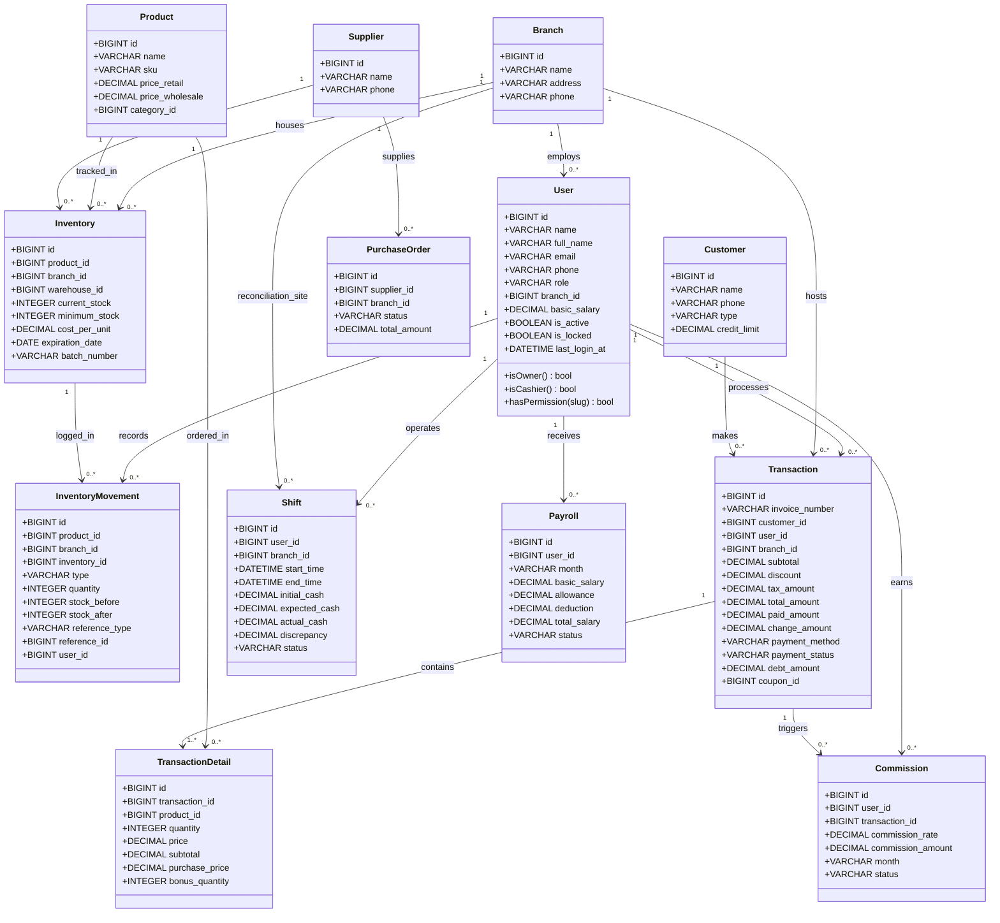
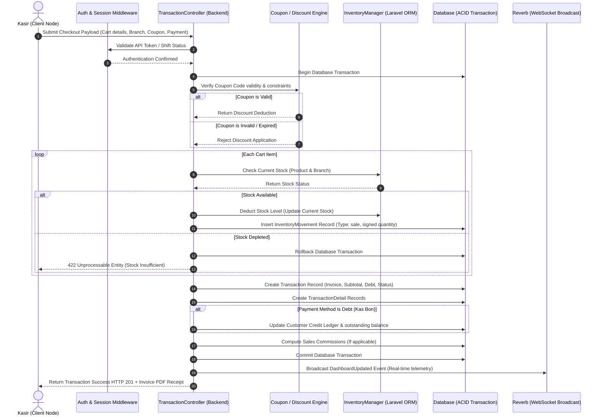
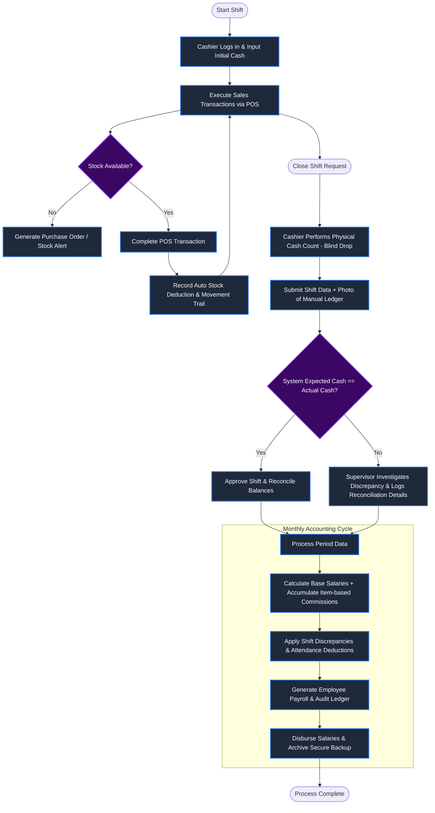

<p align="center">
  
  
  <br>
  
  
  
  
</p>

<h1 align="center">
  APMS — Ashar Parfum Management System
</h1>

<p align="center">
  <strong>The Definitive Enterprise Point-of-Sale, Supply Chain & Business Intelligence Platform</strong><br>
  <sub>Proprietary System Engine for Ashar Grosir Parfum Bekasi - Developed in Indonesia - Architected for High Availability</sub>
</p>

---

## 1. Executive Summary & System Overview

**APMS (Ashar Parfum Management System)** is a proprietary, mission-critical enterprise resource planning (ERP) and point-of-sale (POS) platform engineered exclusively for the operational ecosystem of Ashar Grosir Parfum Bekasi.

Version 2.0 (Enterprise) is specifically architected to mitigate operational bottlenecks, eliminate financial discrepancies, and provide real-time, multi-branch visibility. It integrates disparate business domains—ranging from frontline retail transactions and high-volume B2B wholesale logistics to complex human resource payroll generation—into a single, unified data lake.

The system is strictly bound by the principles of **Data Immutability**, **Strict Access Control**, and **Forensic Accountability**, ensuring that every mutation within the system leaves a permanent, cryptographically sound audit trail.

---

## 2. Infrastructure & System Architecture

APMS employs a robust "Decoupled Monolith" architecture, prioritizing execution speed and maintenance simplicity over unnecessary microservice fragmentation, while remaining highly scalable horizontally.

### 2.1 Core Stack Specifications
- **Application Framework:** Laravel 11.x (PHP 8.2+). Chosen for its enterprise-level stability, extensive testing suites, and seamless ORM capabilities.
- **Web Server Layer:** Nginx (Primary Reverse Proxy) / Apache (Application Server). Configured with stringent SSL/TLS 1.3 requirements, HTTP/2 multiplexing, and optimized worker processes.
- **Data Persistence:** MySQL 8.0+ or PostgreSQL 15+. Configured with strict ACID enforcement, InnoDB clustered indexes, and transactional isolation layers.
- **In-Memory Datastore:** Redis 7.x. Serves as the backbone for high-speed query caching, session clustering, rate-limiting algorithms, and queue processing.
- **Real-Time Communication:** Laravel Reverb. Provides a low-latency WebSockets infrastructure necessary for synchronized wholesale order notifications and live POS telemetry.

### 2.2 Architectural Constraints & Strategies
- **Stateless Application Nodes:** The application servers hold no persistent state. All sessions and cached geometries are offloaded to Redis, allowing instantaneous horizontal scaling via Load Balancers (HAProxy/AWS ALB).
- **Asynchronous Processing:** Non-blocking operations (Email Dispatches, End-of-Month Payroll Aggregation, Daily Sales Report Compilations) are delegated to background worker queues, ensuring the UI thread remains continuously responsive.

---

## 3. Database Integrity & Domain Models

The database schema is heavily normalized to 3NF (Third Normal Form) to prevent data anomalies, combined with strategic denormalization (e.g., cached aggregates) for high-performance read pathways.

### 3.1 Structural Safeguards
- **Unbounded Scaling Keys:** Utilization of `BIGINT UNSIGNED` primary constraints, capable of absorbing 18.4 quintillion distinct records without the risk of integer overflow.
- **Financial Precision Protocols:** All monetary matrices (Prices, Transactions, Debts, Payrolls) strictly utilize `DECIMAL(15,2)` paradigms. This absolutely prevents the floating-point truncation errors common in dynamic programming environments.
- **Transactional Atomicity:** All multi-step mutations (e.g., "Checkout" requires writing to `transactions`, writing to `transaction_details`, and decrementing `inventories`) are wrapped in strict Database Transactions. A failure at any sub-step instantly triggers a full rollback.
- **Historical Immutability (Soft Deletes):** Records are never hard-deleted via `DELETE` statements. Instead, a `deleted_at` timestamp is applied. This guarantees that historical reporting structures (like past revenues generated by a now-terminated employee) remain mathematically sound and auditable.

---

## 4. Security Posture & Compliance

APMS integrates military-grade application security protocols, classifying it as a Level 4 Hardened environment.

### 4.1 Access Control & Hardening
- **Multi-Factor Authentication (MFA):** Cryptographic Time-based One-Time Password (TOTP) enforcement required for accounts holding elevated privileges (Owner/Admin).
- **Session Hardening:** Dynamic session regeneration upon privilege escalation, strict idle-timeout termination, and HTTPOnly/Secure flagged cookies.
- **Network Perimeter Defense:** Built-in IP Geofencing and Blacklisting middleware. Access to administrative panels can be mathematically restricted to predefined corporate subnet blocks (CIDR).
- **Rate Limiting & Throttling:** Exponential backoff algorithms applied to authentication endpoints to neutralize brute-force and dictionary attacks.

### 4.2 Forensic Audit Logging
An immutable logging mechanism captures every significant state change across the platform. The forensic ledger records:
- Authenticated `User ID` and Role Status.
- Target Model and specific mutated fields (Before & After states).
- Originating `IP Address` and Client `User-Agent`.
- Precise UTC Timestamp.

### 4.3 Environment Secrecy
The codebase contains zero hardcoded cryptographic keys, database passwords, or third-party API tokens. All sensitive vectors are injected strictly via server-level environment variables (`.env`), which are fundamentally excluded from version control.

---

## 5. Role-Based Access Control (RBAC) & Multi-Branch Topology

APMS operates on a strict Principle of Least Privilege (PoLP) utilizing an advanced, multi-tenant capable RBAC engine.

### 5.1 Authorization Tiers
1. **Owner (Super Administrator):** Unrestricted access. Capable of cross-branch financial aggregations, global parameter tuning, system-wide audits, and overriding locked transactions.
2. **Administrator / Manager:** High-level operational supervisors. Capable of executing Purchase Orders (POs), generating payroll, viewing restricted P&L reports, and managing wholesale fulfillment.
3. **Cashier (Kasir):** Frontline terminal operators. Strictly confined to the Retail POS interface, basic customer registration, and their individual shift management.

### 5.2 Branch Data Isolation
Every user (excluding the Owner tier) and transaction is cryptographically bound to a specific `branch_id`. Global queries inherently apply tenant scopes, making it impossible for a Cashier in "Branch A" to view inventory levels or financial data of "Branch B".

---

## 6. Comprehensive Module Ecosystem

### 6.1 Point-of-Sale (POS) & Checkout Engine
- **Dual-Pricing Algorithms:** Instantaneous dynamic switching between Retail (Eceran) and Wholesale (Grosir) tiers. The system automatically recalculates total cart values based on the active pricing tier matrix.
- **Loyalty & Discount Verification:** Real-time coupon parsing, validating expiration dates, minimum spend thresholds, and maximum usage caps before applying percentage or fixed deductions.
- **Hybrid Payment Gateways:** Natively supports Cash, Bank Transfer, and Kas Bon (Authorized Customer Debt), directly routing funds to the appropriate digital ledger.

### 6.2 Supply Chain & Inventory Logistics
- **Concurrent Stock Deduction:** Inventory integers are decremented at the exact millisecond of a transaction commit, preventing overselling in high-velocity environments.
- **Purchase Order (PO) Lifecycles:** Tracks supplier acquisitions from Draft -> Submitted -> Received. Automatically updates moving average costs (COGS) to calculate true profit margins.
- **Expiry Matrix:** Chronological tracking of batch expiration dates. Generates automated alert thresholds (e.g., 90 days before expiry) to prioritize stock liquidation and mitigate dead-stock financial loss.

### 6.3 Human Capital & Payroll Automation
- **Shift Reconciliation (Blind Drops):** Cashiers must execute structured Open/Close shift protocols. Discrepancies between the system-calculated expected drawer balance and physical cash input demand photographic evidence of manual ledgers.
- **Algorithmic Payroll:** Eliminates manual accounting. Payroll is generated dynamically by aggregating base salaries, attendance deductions, and transparent, item-based sales commissions within the pay period.

### 6.4 Customer Relationship Management (CRM)
- **Wholesale Client Portals:** Isolated interfaces permitting B2B clients to authenticate, review historical statements, track active order fulfillment, and monitor their outstanding credit balances.
- **Debt Aging Visualizations:** Automated chronological categorization of outstanding receivables (0-30 days, 31-60 days, etc.) to streamline collection efficiency.

---

## 7. Disaster Recovery & Business Continuity (DRP)

### 7.1 Automated Backup Topology
- **Nightly Snapshots:** Automated cron schedulers execute full SQL dumps daily at 03:00 AM (Off-Peak).
- **Encrypted Archives:** Dumps are compressed and AES-256 encrypted before being routed to secure, off-site secondary storage layers (AWS S3 / GCP Storage).
- **Auto-Pruning Rotation:** Retains daily backups for 30 days, weekly backups for 3 months, and monthly backups indefinitely, actively preventing storage inflation.

### 7.2 Application Monitoring
- **Real-time Exception Tracking:** Laravel Log aggregation capturing stack traces, queue timeout failures, and payload validation anomalies.
- **Security Dashboard:** High-level UI explicitly for Owners to visualize brute-force attempts, IP block-lists, and database integrity checksums.

---

## 8. Development, Integration & Deployment Workflow

### 8.1 Local Environment Provisioning
```bash
# 1. Clone the Official Repository (Restricted Access)
git clone https://github.com/wi5nuu/asharparfummanagementsystem.git
cd APMS

# 2. Resolve PHP & Node Dependencies (Production Mode)
composer install --optimize-autoloader --no-dev
npm install && npm run build

# 3. Environment Variable Injection
cp .env.example .env
php artisan key:generate

# 4. Database Schema Migration & Seeding
# ENSURE .env DATABASE CREDENTIALS ARE ACCURATE
php artisan migrate --force
php artisan db:seed --class=DatabaseSeeder

# 5. Core Application Bootstrapping
php artisan storage:link
php artisan optimize:clear
php artisan config:cache
php artisan event:cache
php artisan route:cache
php artisan view:cache
```

### 8.2 Continuous Integration (CI/CD) Specifications
All codebase mutations are strictly managed via Git version control. Production deployments are gated behind automated pipelines that enforce:
1. Syntactic Validation (PHPStan / Pint).
2. Unit and Feature Testing (PHPUnit) with mandatory >80% coverage requirements on core financial controllers.
3. Vulnerability Scanning of all composer dependencies.

---

## 9. Comprehensive System Diagrams

To ensure technical alignment, this section documents the system data models, transaction flow sequences, and operational logic workflows of APMS.

### 9.1 Database & Entity-Relationship Model (Class Diagram)

The following class diagram represents the core business entities, their persistent attributes, and their relational scopes within the APMS decoupled monolith:



### 9.2 Transaction Lifecycle (Sequence Diagram)

The sequence below illustrates the POS Checkout pipeline, covering authentication, ACID transaction scopes, discount processing, stock checking, and concurrent stock updates:



### 9.3 Operational Lifecycle & Accounting Flow (Workflow Diagram)

The flowchart below demonstrates the business logic flow from the opening of a cashier shift to the monthly payroll/commission calculation:



---

## 10. Legal, Proprietary & Licensing Notice

**Corporate Headquarters:**
Ashar Grosir Parfum Bekasi
Bekasi, West Java, Indonesia
[www.ashargrosirparfum.com](http://www.ashargrosirparfum.com)

**Lead Technical Architect & Systems Engineer:**
Wisnu Alfian Nur Ashar (wisnualfian117@gmail.com)

**Terms of Use & Copyright Disclaimer:**
Copyright (c) 2024-2026 Ashar Grosir Parfum Group. All Rights Reserved.

The APMS software suite is classified as highly confidential, proprietary, and closed-source enterprise software. This repository, including its architectural models, database schemas, and interface designs, is the exclusive intellectual property of the Ashar Grosir Parfum Group. 

Any unauthorized viewing, downloading, reproduction, reverse engineering, redistribution, or modification of this source code—in whole or in part—without explicit, cryptographically signed written permission from the technical architect is strictly prohibited. Violators will be subject to immediate litigation under international intellectual property statutes.
