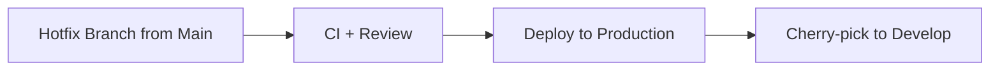

# Development Workflow

## Why This Workflow?

The development workflow is designed to balance **speed of delivery** with **code quality and reliability**. Every step has a specific purpose:

### Feature Branches
Isolate work-in-progress from stable code. Multiple developers can work simultaneously without conflicts.

### CI Pipeline
Automates quality checks so that human reviewers can focus on architectural and business logic concerns rather than style or type errors.

### Code Review
Catches design issues, security vulnerabilities, and knowledge-sharing gaps. Every PR is a learning opportunity.

### Blue-Green Deployment
Eliminates downtime and provides instant rollback capability. Essential for a retail system where every minute of downtime costs money.

### Post-Deployment Monitoring
Errors happen. Monitoring ensures we catch them before customers do.

## Workflow Diagram

```mermaid
flowchart LR
    subgraph Development
        A[Feature Branch] --> B[Local Development]
        B --> C[Push to Origin]
    end
    subgraph CI
        C --> D[Build & Test]
        D --> E[Static Analysis]
        E --> F[Security Scan]
    end
    subgraph Review
        F --> G[Code Review]
        G --> H[Approval]
    end
    subgraph Deploy
        H --> I[Merge to Main]
        I --> J[Deploy to Staging]
        J --> K[Smoke Tests]
        K --> L[Deploy to Production]
    end
    subgraph Monitor
        L --> M[Post-Deploy Monitoring]
        M -->|Issues| N[Rollback / Hotfix]
    end
```

## Hotfix Flow

For critical issues, the hotfix flow bypasses the staging step:

Hotfixes still require CI passing and at least one review. The risk is mitigated by the rollback capability.
