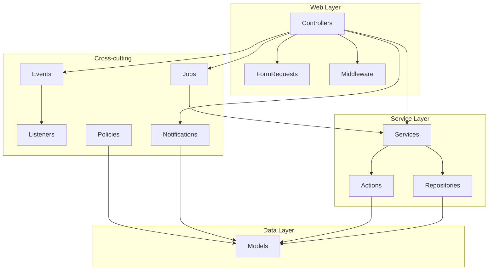
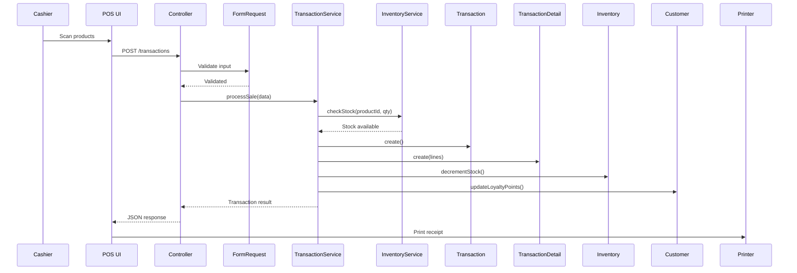
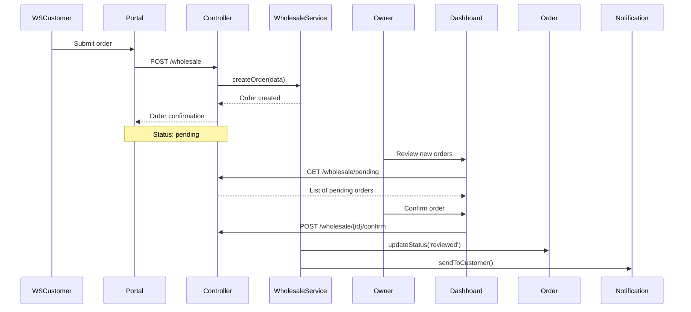

# arc42 Architecture Documentation — APMS

## §1 Introduction & Goals

### 1.1 Requirements Overview

APMS is a multi-branch perfume retail and wholesale management system. Key requirements:

- Point-of-Sale for retail cashier operations
- Multi-branch inventory management
- Wholesale order lifecycle management
- Customer loyalty and referral program
- Role-based access control with 10+ roles
- Financial and operational reporting

### 1.2 Quality Goals

| Priority | Quality | Motivation |
|---|---|---|
| 1 | Reliability | POS must function even with intermittent connectivity |
| 2 | Security | Financial data and customer data protection |
| 3 | Maintainability | Multiple developers must work concurrently |
| 4 | Performance | Transactions processed in under 2 seconds |

### 1.3 Stakeholders

See [Stakeholder Registry](../business/stakeholder-registry.md).

## §2 Constraints

### Technical Constraints
- **Language:** PHP 8.2+, Laravel 11.x
- **Database:** MySQL 8.0+
- **Cache/Queue:** Redis 6+
- **Frontend:** Blade + Bootstrap 5 + jQuery
- **Hosting:** On-premise or cloud (AWS/GCP compatible)

### Organizational Constraints
- Team size: 2–5 developers
- Release cycle: Bi-weekly sprints
- Code review required for all PRs

### Business Constraints
- Indonesian tax compliance (PPN)
- Multi-branch real-time synchronization
- Wholesale customer self-service portal

## §3 Context & Scope

See [C4 Level 1 — System Context](c4-level-1-context.md).

### Business Context
APMS is used entirely within AL'ASHAR PARFUM's operations. External actors are wholesale customers (portal) and retail customers (invoice view only).

### Technical Context
System integrates with: MySQL, Redis, MinIO/S3, SMTP/Mailgun, WhatsApp API.

## §4 Solution Strategy

### Architecture Style
**Modular Monolith** with domain-oriented module organization. The system uses:

- **Service Layer pattern** for business logic
- **Repository pattern** for data access abstraction
- **Action pattern** for single-responsibility operations
- **Event-Driven** for cross-module communication (Laravel Events)
- **Queue-based** for async processing (Laravel Queues + Horizon)

### Key Technology Decisions
| Decision | Choice | Rationale |
|---|---|---|
| Framework | Laravel 11 | Mature ecosystem, built-in features matching requirements |
| Auth | Laravel Sanctum | Simple token-based API auth |
| Queue | Redis + Horizon | Robust job monitoring, auto-scaling workers |
| Cache | Redis | Shared cache across multiple web servers |
| Search | MySQL FULLTEXT | Sufficient for current scale, no external dependency |

## §5 Building Block View

### Level 1 — Application Modules

```
app/
├── Http/
│   ├── Controllers/        # Route handlers
│   ├── Middleware/          # Request filters (auth, throttle, security)
│   ├── Requests/            # Form request validation
│   └── Resources/           # API resource transformations
├── Models/                  # Eloquent models
├── Services/                # Business logic services
├── Repositories/            # Data access layer
├── Observers/               # Model event observers
├── Events/                  # Event classes
├── Listeners/               # Event handlers
├── Notifications/           # Notification classes
├── Jobs/                    # Queue job classes
├── Console/Commands/        # Artisan commands
├── Exceptions/              # Custom exception classes
├── Rules/                   # Custom validation rules
├── Policies/                # Authorization policies
├── Traits/                  # Shared traits
└── Providers/               # Service providers
```

### Level 2 — Key Module Dependencies



## §6 Runtime View

### 6.1 POS Transaction Flow



### 6.2 Wholesale Order Flow



## §7 Deployment View

See [Deployment Diagram](deployment-diagram.md).

### Development Environment
- Local PHP artisan serve + MySQL + Redis
- Docker Compose for service orchestration

### Production Environment
- Nginx + PHP-FPM (multiple workers)
- MySQL with read replicas
- Redis for cache and queues
- MinIO/S3 for file storage
- Supervisor for queue workers
- Horizon for queue monitoring

## §8 Crosscutting Concepts

### 8.1 Domain Models
See [Domain Model](../requirements/domain-model.md).

### 8.2 Architecture Patterns
- **Service Layer:** Business logic encapsulated in Service classes
- **Repository Pattern:** Data access abstracted behind interfaces
- **Action Pattern:** Complex operations in single-action classes
- **Observer Pattern:** Model lifecycle events via Observers
- **Event-Driven:** Decoupled communication via Events/Listeners

### 8.3 Security
See [Security Reference](../security/rbac-matrix.md).

### 8.4 Transaction Handling
- All financial operations wrapped in DB transactions
- Pessimistic locking for inventory operations
- Queue jobs with failed-job retry and dead-letter handling

### 8.5 Exception Handling
See [Error Handling Strategy](../backend/error-handling-strategy.md).

## §9 Architecture Decisions

See [Architecture Decision Records](../../explanation/decisions/).

| ADR | Title | Status |
|---|---|---|
| ADR-001 | Database: MySQL | Accepted |
| ADR-002 | Auth: Laravel Sanctum | Accepted |
| ADR-003 | Cache: Redis | Accepted |
| ADR-004 | Queue: Redis + Horizon | Accepted |
| ADR-005 | Search: MySQL FULLTEXT | Accepted |
| ADR-006 | Deployment: Blue/Green | Accepted |
| ADR-007 | Cloud: On-premise → AWS | Proposed |

## §10 Quality Requirements

See [Non-Functional Requirements](../product/non-functional-requirements.md).

Quality trees and scenarios are documented per ISO/IEC 25010 categories.

## §11 Risks & Technical Debt

| Risk | Impact | Probability | Mitigation |
|---|---|---|---|
| Database scaling at order volume growth | High | Medium | Implement read replicas, query optimization, caching |
| Offline POS capability not implemented | High | Low | Deferred; network reliability sufficient |
| jQuery dependency limits frontend evolution | Medium | High | Gradual migration to Livewire or Vue |
| Test coverage below 80% | Medium | Medium | Enforce coverage gates in CI |

## §12 Glossary

See [Master Glossary](../../GLOSSARY.md).
