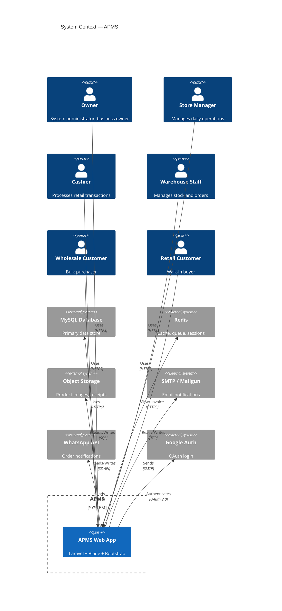

# C4 Level 1: System Context Diagram

## Diagram

## Description

The APMS system is a monolithic Laravel web application serving six user groups:

1. **Owner** — Full system access, manages wholesale customers, views reports
2. **Store Manager** — Day-to-day operations, inventory, staff management
3. **Cashier** — POS retail transaction processing
4. **Warehouse Staff** — Inventory fulfillment and stock management
5. **Wholesale Customer** — Self-service portal for order placement and tracking
6. **Retail Customer** — Limited access (invoice viewing only)

The system integrates with five external systems for data persistence, caching, messaging, and authentication.
