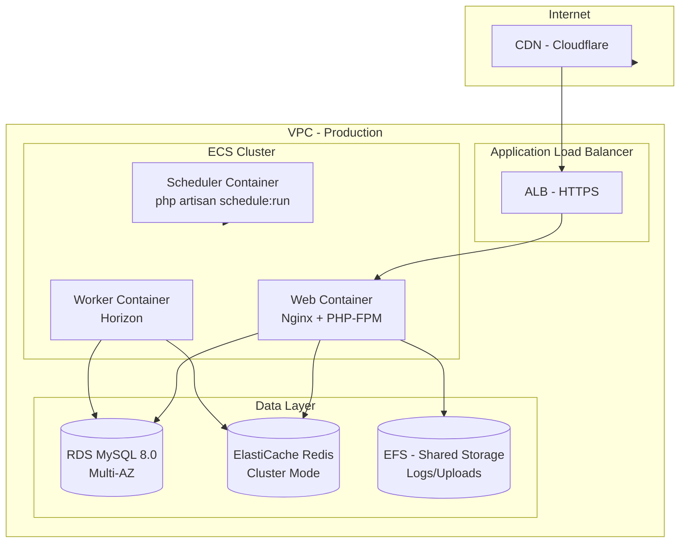

# Infrastructure Diagram (C4 Level 2 — Container)

## Resource Specification (Production)

| Resource | Spec | Scaling |
|---|---|---|
| Web Container | 2 vCPU, 4 GB RAM | Min 2, Max 6 (CPU 70%) |
| Worker Container | 2 vCPU, 4 GB RAM | Min 1, Max 4 (Queue depth) |
| RDS Instance | db.r6g.large (2 vCPU, 16 GB) | Multi-AZ, auto-scaling storage |
| Redis | cache.r6g.large (1.3 GB) | Cluster mode, 2 shards |
| EFS | General Purpose | Bursting throughput |
