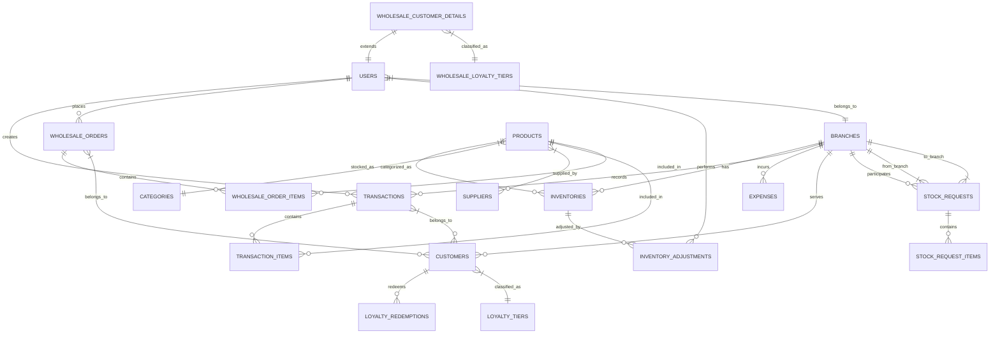

# Entity Relationship Summary

## Polymorphic Relationships

| Table | Morph Column 1 | Morph Column 2 | Target |
|---|---|---|---|
| `notifications` | `notifiable_type` | `notifiable_id` | Users, WholesaleCustomers |
| `activity_logs` | `subject_type` | `subject_id` | Various models |
| `attachments` | `attachable_type` | `attachable_id` | Transactions, Products |

## Soft Delete Rules

- Models with `SoftDeletes`: Products, Users, Categories, Suppliers, WholesaleOrders
- All queries for owner/admin panels use `withTrashed()`
- Deleting a parent cascades via model event, NOT DB constraint
