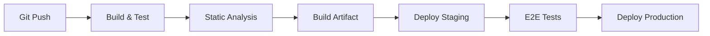

# CI/CD Pipeline

## Pipeline Architecture

## Stages

| Stage | Actions | Estimated Time |
|---|---|---|
| Build | `composer install --no-dev`, `npm ci && npm run build` | 3 min |
| Test | `php artisan test --parallel` | 5 min |
| Analyze | PHPStan, Pint, Rector | 2 min |
| Security | `composer audit`, Snyk scan | 2 min |
| Artifact | Package build + upload | 1 min |
| Deploy Staging | Deploy to staging env | 2 min |
| E2E | Dusk or Playwright suite | 10 min |
| Deploy Production | Blue-green deploy | 5 min |

## Branch Strategy

| Branch | CI/CD Action |
|---|---|
| `main` | Full pipeline → Production |
| `develop` | Build + Test → Staging |
| `feature/*` | Build + Test only |
| `hotfix/*` | Full pipeline → Production (expedited) |

## Environment Variables

- Secrets stored in CI/CD variables (not in repo)
- `.env.example` committed with placeholder values
- Production `.env` deployed via secure artifact
