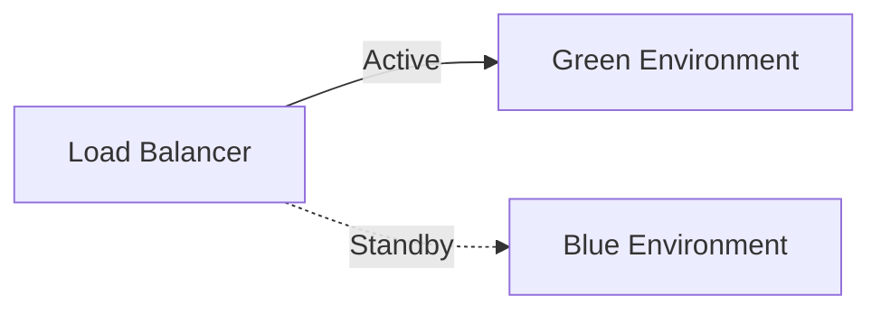

# Deployment Strategy

## Model: Blue-Green Deployment



1. Deploy new version to **idle** environment (Blue if Green is active)
2. Run smoke tests against idle environment
3. Switch load balancer to new environment
4. Keep old environment running for **15 min** (rollback window)
5. If errors → switch back to old environment
6. After 15 min → retire old environment

## Deployment Commands

```bash
# Maintenance mode
php artisan down --retry=60

# Migrate
php artisan migrate --force

# Clear cache
php artisan optimize:clear
php artisan optimize

# Restart workers
php artisan queue:restart

# Bring back up
php artisan up
```

## Rollback Procedure

1. Switch load balancer to previous environment
2. Run `php artisan migrate:rollback --step=1`
3. Verify application health
4. Investigate root cause
