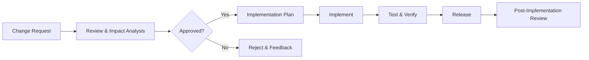

# Change Management

## Change Types

| Type | Description | Approval |
|---|---|---|
| Standard | Pre-approved, low risk (dependency update, config change) | Team Lead |
| Normal | Medium risk (feature, UI change) | Tech Lead + QA |
| Major | High risk (infrastructure, database schema, architecture) | Project Lead + Tech Lead |
| Emergency | Fix critical issue (SEV1/SEV2) | On-call engineer (post-review required) |

## Change Process

## Documentation Requirements

| Change Type | Documentation Required |
|---|---|
| Standard | Brief description in commit message |
| Normal | Jira/GitHub issue with description, test results |
| Major | Change document with impact analysis, rollback plan |
| Emergency | Post-incident review within 48 hours |
