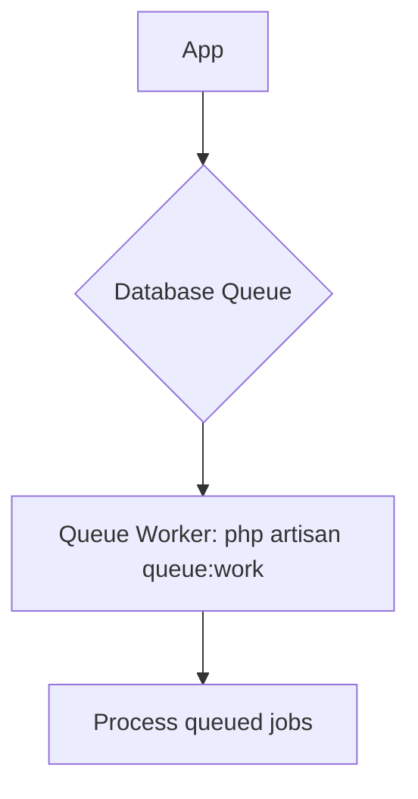

# Queue & Job Reference

## Configuration (Current)

| Setting | Value |
|---|---|
| Default Connection | `database` |
| Fallback | `failover` (database + deferred) |
| Failed Driver | `database` |
| Horizon | Not deployed (available as future option) |

## Queue Architecture (Current)



### Future/Planned (see ADR-004)

Redis + Horizon for production deployment with separate workers for high/default/low/notifications.

## Job Inventory (scheduled via Console Kernel)

| Command | Schedule | Description |
|---|---|---|
| `app:generate-daily-reports` | `dailyAt('23:00')` | Generate end-of-day reports (planned) |
| `app:backup-database` | `dailyAt('02:00')` | Automated database backup (`spatie/laravel-backup`) |
| `app:clean-expired-data` | `weekly` | Remove expired session/cache data |
| `app:calculate-commissions` | `monthlyOn(1, '03:00')` | Calculate monthly commissions |
| `app:send-stock-alerts` | `hourly` | Notify low stock thresholds |

## Running Workers

```bash
# Start default worker (processes jobs synchronously)
php artisan queue:work

# Process a single job
php artisan queue:work --once

# List failed jobs
php artisan queue:failed

# Retry failed jobs
php artisan queue:retry all

# Clear failed jobs
php artisan queue:flush
```

## Backup (via spatie/laravel-backup)

| Setting | Value |
|---|---|
| Retention | 7 days (all), 16 daily, 8 weekly, 4 monthly, 2 yearly |
| Max storage | 5GB |
| Notifications | Email on success/failure |
