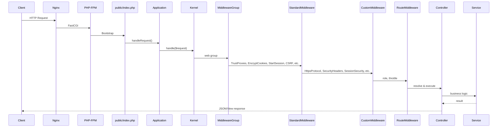

# Request Lifecycle

## Flow

## Middleware Configuration

Configured in `bootstrap/app.php` with Laravel 12's `withMiddleware()` API.

### Custom Middleware (appended to `web` group)

Order of execution (appended in this order):

| Order | Middleware | Class |
|---|---|---|
| 1 | `HttpsProtocol` | `HttpsProtocolMiddleware` |
| 2 | `SecurityHeaders` | `SecurityHeadersMiddleware` |
| 3 | `SessionSecurity` | `SessionSecurityMiddleware` |
| 4 | `LoginThrottle` | `LoginThrottleMiddleware` |
| 5 | `IpSecurity` | `IpSecurityMiddleware` |
| 6 | `IdleTimeout` | `IdleTimeoutMiddleware` |
| 7 | `InputSanitizer` | `InputSanitizerMiddleware` |
| 8 | `RedirectWholesaleCustomer` | `RedirectWholesaleCustomer` |

### Middleware Aliases

| Alias | Class | Usage |
|---|---|---|
| `role` | `RoleMiddleware` | `Route::middleware('role:owner,admin_pusat')` |
| `https` | `HttpsProtocolMiddleware` | Force HTTPS per route |
| `security` | `SecurityHeadersMiddleware` | Security headers per route |
| `throttle.login` | `LoginThrottleMiddleware` | Login rate limiting (5/15min) |
| `ip.security` | `IpSecurityMiddleware` | IP allow/block per route |

### Standard Laravel Middleware (web group)

Applied by default to all web routes: `EncryptCookies`, `AddQueuedCookiesToResponse`, `StartSession`, `ShareErrorsFromSession`, `VerifyCsrfToken`, `SubstituteBindings`.

## Route Middleware

| Name | Class | Applied To |
|---|---|---|
| `auth` | `Authenticate` | All authenticated routes |
| `verified` | `EnsureEmailIsVerified` | Operations routes (POS, shifts, etc.) |
| `role:{roles}` | `RoleMiddleware` | Role-based route groups |
| `throttle:{max},{min}` | `ThrottleRequests` | Rate-limited routes (Laravel built-in) |
