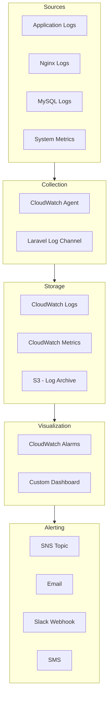

# Monitoring Architecture

## Monitoring Stack

| Component | Tool | Purpose |
|---|---|---|
| Log aggregation | CloudWatch Logs | Centralized log storage |
| Metrics | CloudWatch Metrics | CPU, memory, request count, latency |
| APM | — (planned: Laravel Telescope) | Performance tracing |
| Uptime | CloudWatch Synthetics | Synthetic transaction monitoring |
| Error tracking | — (planned: Sentry) | Exception aggregation |
| Queue monitoring | Laravel Horizon | Queue status & throughput |

## Key Metrics

| Metric | Source | Alert Threshold |
|---|---|---|
| CPU Utilization | ECS | >80% for 5 min |
| Memory Utilization | ECS | >85% for 5 min |
| 5xx Error Rate | ALB | >1% for 5 min |
| P95 Response Time | ALB | >2000ms for 5 min |
| Queue Depth | Horizon | >100 for 10 min |
| DB Connections | RDS | >80% max_connections |
| Disk Usage | EFS | >85% |
