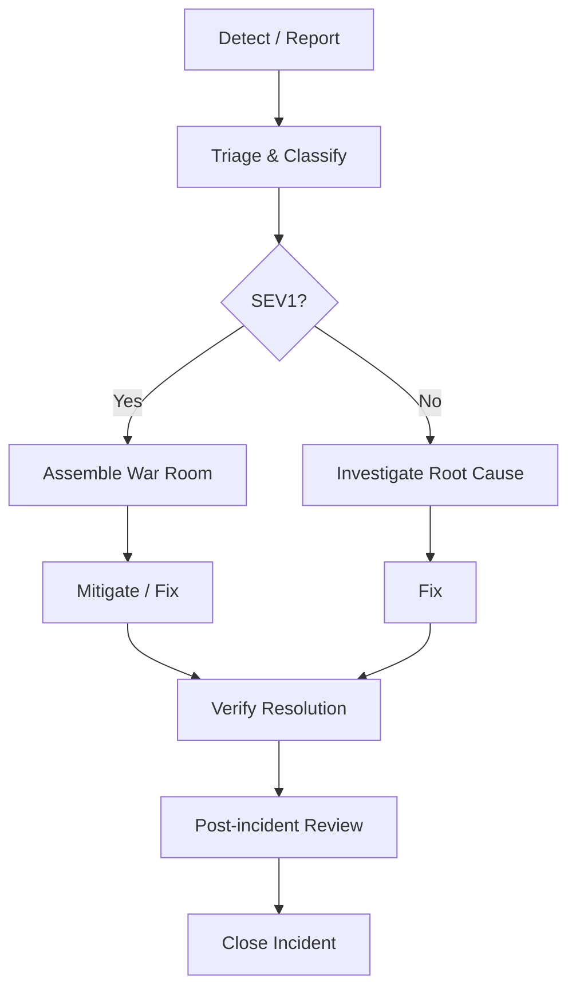

# Incident Response

## Incident Severity Levels

| Level | Definition | Examples |
|---|---|---|
| SEV1 — Critical | System unavailable, data loss risk | DB crash, security breach |
| SEV2 — High | Major feature broken, performance impact | Login broken, slow responses |
| SEV3 — Medium | Minor feature broken, workaround exists | Wrong label, cosmetic bug |
| SEV4 — Low | Cosmetic / non-functional | Typo, visual glitch |

## Response Flow

## Communication

| Channel | Purpose | Audience |
|---|---|---|
| Slack #incidents | Real-time updates | Engineering team |
| Email | Summary | All stakeholders |
| Status page | Public status | Customers |

## Post-Mortem Template

- **Date & Time**: Incident window
- **Severity**: SEV1 / SEV2 / SEV3 / SEV4
- **Impact**: Users affected, duration, feature impact
- **Root Cause**: Technical explanation
- **Timeline**: Key events in UTC
- **Resolution**: What was done to fix
- **Action Items**: Preventive measures with owners and deadlines
