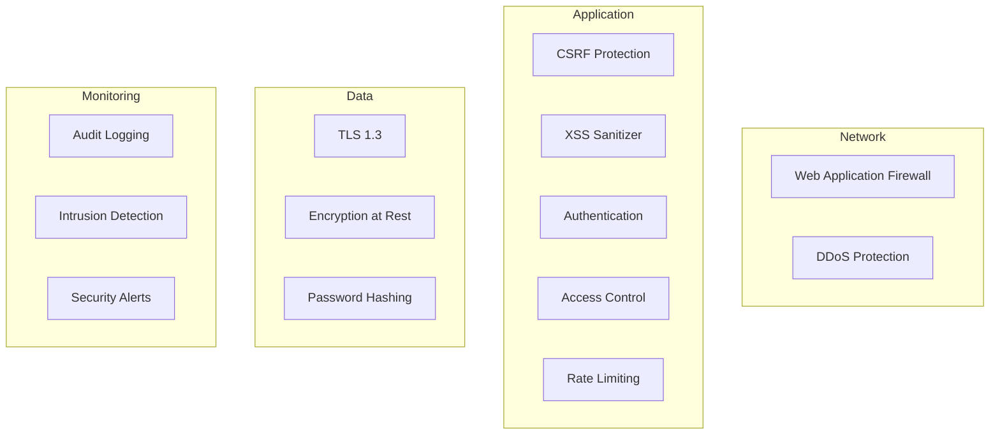

# Security Architecture

## Security Principles

1. **Defense in depth** — multiple layers of security controls
2. **Least privilege** — minimum permissions per role
3. **Secure by default** — secure configuration out of the box
4. **Fail secure** — errors default to denying access
5. **Input validation** — all input validated and sanitized

## Security Layers

## Current Controls

| Control | Implementation |
|---|---|
| HTTPS enforcement | Middleware `HttpsProtocol` |
| HSTS | `Strict-Transport-Security` header |
| CSP | `Content-Security-Policy` header |
| XSS protection | `InputSanitizer` middleware |
| CSRF | Laravel CSRF token on all state-changing requests |
| SQL injection | Eloquent ORM (parameterized queries) |
| Session hijacking | `SessionSecurity` middleware (IP + user-agent check) |
| Brute force | `LoginThrottle` middleware (5 attempts/15min) |
| Idle timeout | `IdleTimeout` middleware (configurable) |
| IP allow/block | `IpSecurity` middleware |
| Rate limiting | `throttle` middleware on routes |
| Password hashing | bcrypt (cost 12) |
| Encryption at rest | AES-256-CBC (Laravel APP_KEY) |

## Compliance Mapping

| Requirement | Control | Standard |
|---|---|---|
| Access control | Role/permission system | OWASP AC |
| Input validation | Form requests + sanitizer | OWASP IV |
| Cryptography | TLS 1.3 + bcrypt + AES-256 | OWASP CR |
| Logging | Activity logger | OWASP LT |
| Session management | Secure cookie + Redis | OWASP SM |
