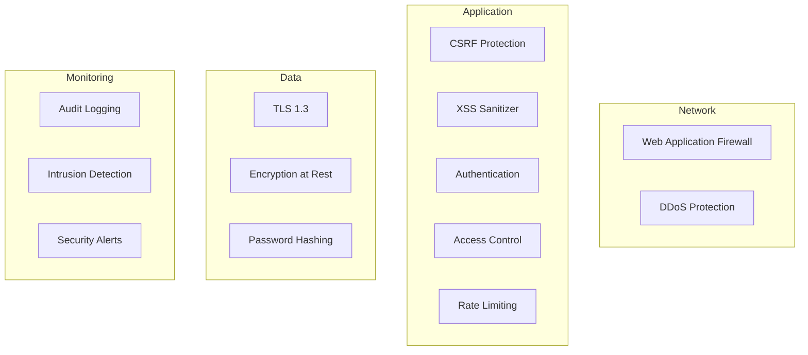

# Security Architecture

## Security Principles

1. **Defense in depth** — multiple layers of security controls
2. **Least privilege** — minimum permissions per role
3. **Secure by default** — secure configuration out of the box
4. **Fail secure** — errors default to denying access
5. **Input validation** — all input validated and sanitized

## Security Layers

```mermaid
flowchart TD
    subgraph Network
        WAF[Web Application Firewall]
        DDoS[DDoS Protection]
    end
    subgraph Application
        CSRF[CSRF Protection]
        XSS[XSS Sanitizer]
        Auth[Authentication]
        ACL[Access Control]
        Rate[Rate Limiting]
    end
    subgraph Data
        TLS[TLS 1.3]
        Encrypt[Encryption at Rest]
        Hash[Password Hashing]
    end
    subgraph Monitoring
        Audit[Audit Logging]
        IDS[Intrusion Detection]
        Alert[Security Alerts]
    end
```

## Current Controls

| Control | Implementation | Status |
|---|---|---|
| HTTPS enforcement | `SecurityHeadersMiddleware` — HSTS header | ✅ Active |
| CSP | `SecurityHeadersMiddleware` — nonce-based CSP | ✅ Active (note: `unsafe-inline` di `style-src`) |
| XSS protection | `InputSanitizerMiddleware` — strip tags + pattern detection | ✅ Active |
| CSRF | Laravel CSRF token on all state-changing requests | ✅ Active |
| SQL injection | Eloquent ORM (parameterized queries); semua `DB::raw()` pakai nilai hardcoded | ✅ Active |
| Session hijacking | `SessionSecurityMiddleware` — IP change logging, locked account check, 2FA enforcement | ✅ Active |
| Brute force | `LoginThrottleMiddleware` via `ActivityMonitor` | ✅ Active |
| Idle timeout | `IdleTimeoutMiddleware` — sesuai `session.lifetime` config | ✅ Active |
| IP allow/block | `IpSecurityMiddleware` — rate limit 200 req/min, auto-block | ✅ Active |
| Rate limiting | `throttle` middleware pada routes + API (60/min general, 120/min admin) | ✅ Active |
| Password hashing | bcrypt (Laravel default cost 10) | ✅ Active |
| Encryption at rest | AES-256-CBC (Laravel APP_KEY) | ✅ Active |
| Session security | `encrypt=true`, `expire_on_close=true`, `httponly=true`, `secure=true` | ✅ Active |
| Wholesale isolation | `RedirectWholesaleCustomer` middleware — isolasi route `wholesale_customer` | ✅ Active |
| Force password change | `SessionSecurityMiddleware` — redirect ke change password jika flag aktif | ✅ Active |
| Authorization | Gate-based (30+ gates di `AppServiceProvider`) + Policy-based + RBAC permissions | ✅ Active |
| WAF / DDoS | Tidak ada di level aplikasi — bergantung pada cPanel/hosting provider | ⚠️ Hosting-dependent |

## Known Gaps & Notes

| Item | Detail |
|---|---|
| `unsafe-inline` di `style-src` CSP | Minor XSS risk; perlu refactor inline styles ke stylesheet terpisah |
| `IdleTimeoutMiddleware` | `session()->flush()` tanpa regenerate token — minor race condition |
| WAF / DDoS protection | Tidak diimplementasi di level aplikasi; bergantung hosting |
| Redis session | Optional — fallback ke file session di cPanel shared hosting |

## Deployment Context

- **Hosting:** cPanel shared hosting (Apache + MySQL)
- **Session driver:** file (Redis opsional)
- **TLS:** via cPanel/hosting provider (Let's Encrypt atau SSL panel)
- **Broadcast:** Laravel Reverb

## Role System

Sistem ini menggunakan **dua layer** authorization:
1. **`users.role` column** — 8 nilai valid: `owner`, `admin`, `manager`, `supervisor`, `cashier`, `warehouse`, `employee`, `wholesale_customer`
2. **RBAC `roles` table** — sistem permission terpisah dengan slug seperti `admin_pusat`, `admin`, dst. Dikelola via `RbacService` dan `RbacController`

> Penting: `admin_pusat` **hanya ada di tabel `roles`** (RBAC), **bukan** di `users.role`. Gate definitions dan middleware harus selalu menggunakan nilai dari `users.role`.

## Compliance Mapping

| Requirement | Control | Standard |
|---|---|---|
| Access control | Gate + Policy + RBAC | OWASP AC |
| Input validation | Form requests + `InputSanitizerMiddleware` | OWASP IV |
| Cryptography | TLS (hosting) + bcrypt + AES-256-CBC | OWASP CR |
| Logging | `ActivityMonitor` + audit log | OWASP LT |
| Session management | Encrypted session, secure cookie, idle timeout | OWASP SM |
