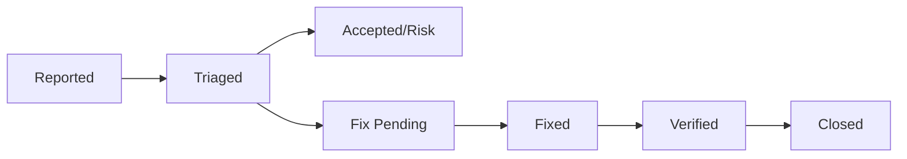

# Vulnerability Management

## Scanning Schedule

| Scan Type | Frequency | Tool |
|---|---|---|
| Dependency scan | Weekly | `composer audit` / Snyk |
| Static analysis | Per commit | PHPStan level 6 |
| SAST | Per commit | (?Sarif-compatible?) |
| DAST | Monthly | OWASP ZAP |
| Penetration test | Annual | Third-party |

## Vulnerability Lifecycle

## Response SLA

| Severity | Response Time | Fix Time |
|---|---|---|
| Critical | 1 hour | 24 hours |
| High | 4 hours | 7 days |
| Medium | 24 hours | 30 days |
| Low | 7 days | 90 days |

## Responsible Disclosure

- Security issues reported to `security@apms.local`
- Acknowledgment within 24 hours
- Disclosure coordinated after fix deployment
