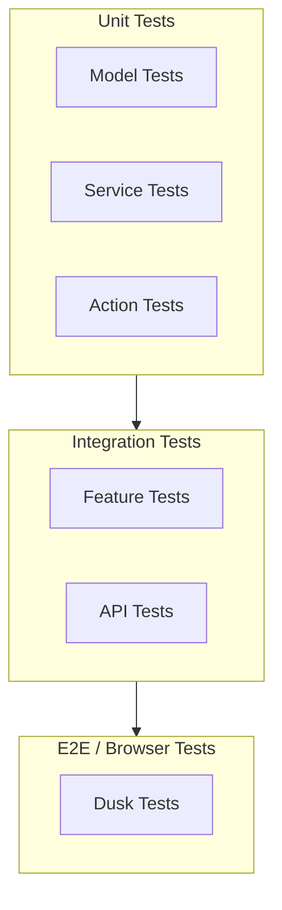

# Test Strategy

## Test Pyramid



## Test Coverage Targets

| Layer | Target | Tool |
|---|---|---|
| Unit (Models) | >90% | PHPUnit |
| Unit (Services) | >85% | PHPUnit |
| Unit (Services) | >85% | PHPUnit |
| Feature (Controllers) | >80% | PHPUnit |
| Feature (API) | >75% | PHPUnit |
| Browser (E2E) | Critical paths | Laravel Dusk |

## Naming Convention

```
tests/
├── Unit/
│   ├── Models/
│   │   └── ProductTest.php
│   ├── Services/
│   │   └── TransactionServiceTest.php

├── Feature/
│   ├── Controllers/
│   │   └── WholesaleOrderControllerTest.php
│   └── Api/
│       └── ProductApiTest.php
└── Browser/
    ├── WholesaleCustomerPortalTest.php
    └── OwnerDashboardTest.php
```

## Testing Rules

- Factory states for every model variant
- Database transactions for feature tests
- HTTP test helpers for authenticated routes
- `RefreshDatabase` for feature tests
- `DatabaseTransactions` for unit tests touching DB
- Mock external services (WhatsApp, RajaOngkir)
- No `sleep()` calls (use `Http::fake()` instead)
