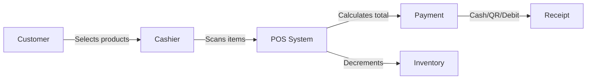

# Understanding the Retail Business Flow

## Learning Objectives

By the end of this tutorial, you will understand:
- How retail transactions flow through the system
- The difference between retail and wholesale operations
- Key business terms used in the application

## The Retail Transaction Flow

### Step-by-Step

1. **Customer arrives** at the counter with products
2. **Cashier scans** each product (or selects from catalog)
3. **System calculates** subtotal, applies discounts, adds PPN (10%, configurable)
4. **Customer pays** via cash, QRIS, debit, or credit
5. **System prints** receipt and **decrements** inventory

## Retail vs Wholesale

| Aspect | Retail | Wholesale |
|---|---|---|
| Customer | Walk-in, unregistered | Registered B2B |
| Payment | Instant at POS | Transfer, trackable |
| Pricing | Fixed retail | Tiered wholesale |
| Fulfillment | Take-away | Shipped |
| Returns | Immediate exchange | 3-day inspection |

## Key Metrics

- **Daily Revenue** — total sales per branch per day
- **Transaction Count** — number of receipts issued
- **Average Transaction Value** — revenue ÷ transactions
- **Low Stock Items** — products below minimum threshold
- **Pending Orders** — wholesale orders awaiting processing
