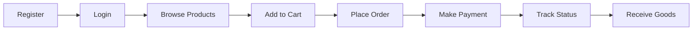

# Wholesale Customer Journey

## Learning Objectives

By the end of this tutorial, you will understand:
- How a wholesale customer interacts with the system
- The password reset flow end-to-end
- How orders are processed from placement to delivery

## Customer Lifecycle



## Password Reset Flow

```mermaid
flowchart LR
    Customer[Customer] -->|Clicks 'Lupa Password'| Form[Forgot Password Form]
    Form -->|Submits email| Request[Request Created]
    Request -->|Owner sees| Pending[Pending Requests Tab]
    Pending -->|Owner clicks 'Setujui & Generate'| Resolve[Request Resolved]
    Resolve -->|New password generated| Show[Password Shown to Owner]
    Show -->|Owner shares password| Customer2[Customer Logs In]
```



## Order Status Flow

```
Pending → Reviewed → On Progress → Packed → Shipped → Delivered → Completed
```

- **Pending**: Order placed, awaiting review
- **Reviewed**: Owner has reviewed the order
- **On Progress**: Being prepared
- **Packed**: Ready for pickup/courier
- **Shipped**: In transit (tracking number available)
- **Delivered**: Customer received
- **Completed**: Order finalized
- **Cancelled**: Order cancelled (any stage before shipped)
